<div align="center">


# InternetRadio

InternetRadio is an Android app for discovering and listening to radio stations from around the world, with features like favorites, recent history, and advanced search by country,language and tags.

</div>

## Download

[](https://play.google.com/store/apps/details?id=com.armanmaurya.internetradio)
[](https://f-droid.org/en/packages/com.armanmaurya.internetradio/)
[](https://github.com/armanmaurya/internetradio/releases/latest/)

---

## Community

Join the Telegram community for discussions, feedback, and announcements, sharing stations:

[](https://t.me/internetradiocommunity)

---

## Features

- **Global Radio Access**: Browse and stream thousands of radio stations globally.
- **Search, Filter & Sort**: Easily find stations by country, language, or tags, with advanced sorting options.
- **Library & Customization**: Manage station Library. Edit any station and configure the startup screen.
- **Android TV Support**: Enjoy a fully optimized and tailored experience on Android TV devices.
- **Android Auto Support**: Support for car screen via android auto.
- **FCast Support**: Cast and control radio stations on FCast-compatible devices.
- **Recording & Scheduling**: Record live streams to your device or set schedules for automated playback and recording.
- **Recent History**: Keep track of your recently played streams.
- **Backup & Restore**: Easily backup and restore your library and app settings.
- **Modern UI**: Built with Jetpack Compose for a smooth, intuitive, and responsive experience across phones, tablets, and widescreen devices.

## Screenshots

### Mobile

<div align="center">
  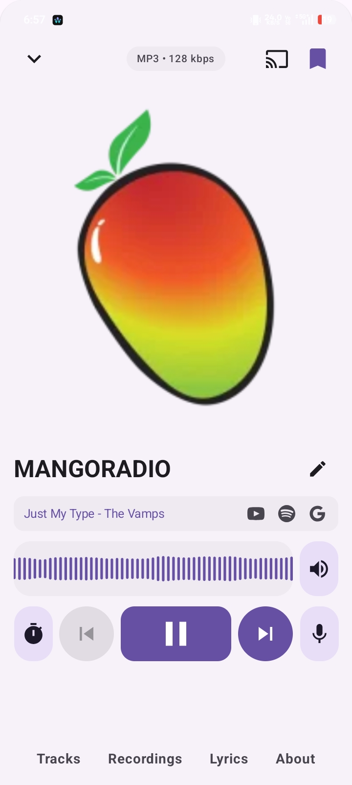
  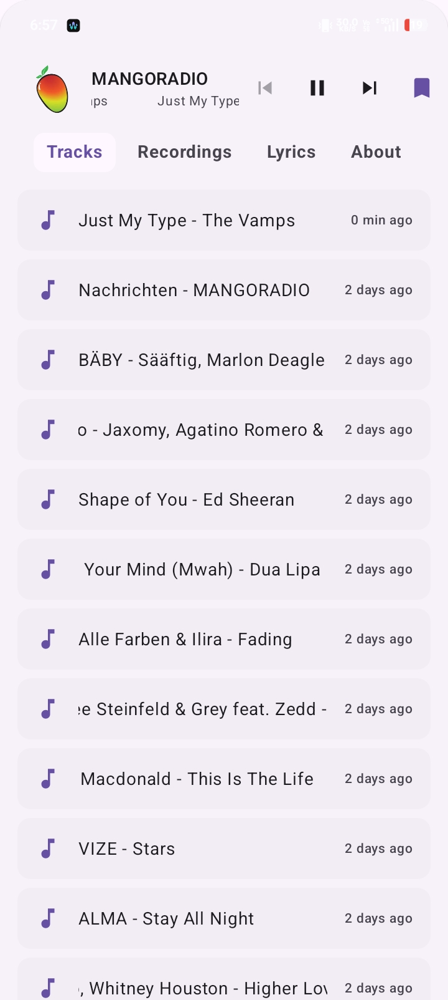
  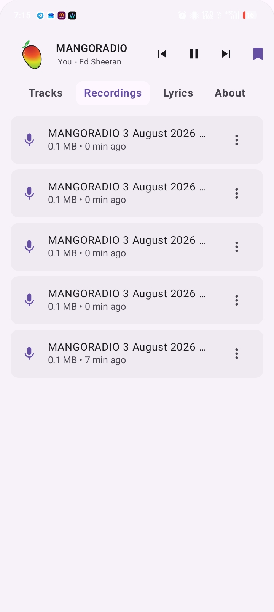
  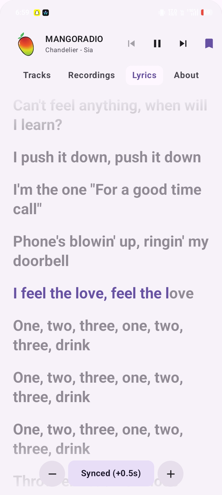
  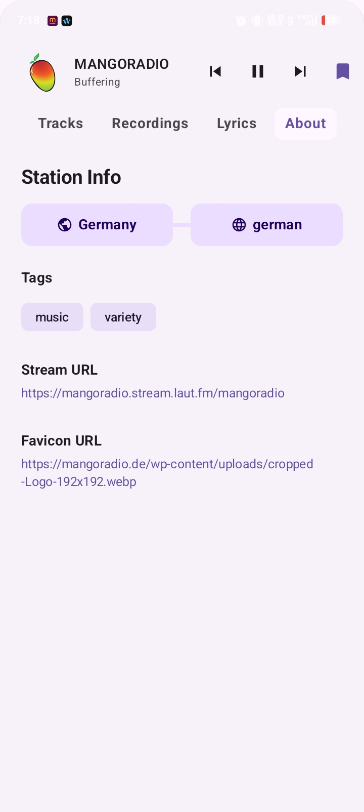
  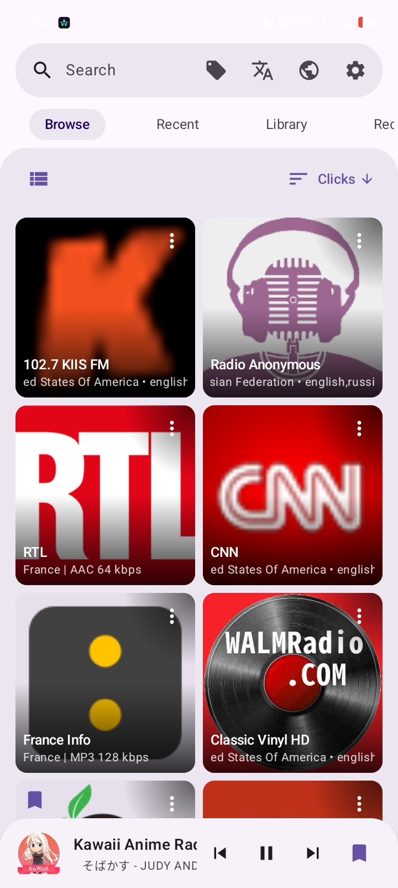
  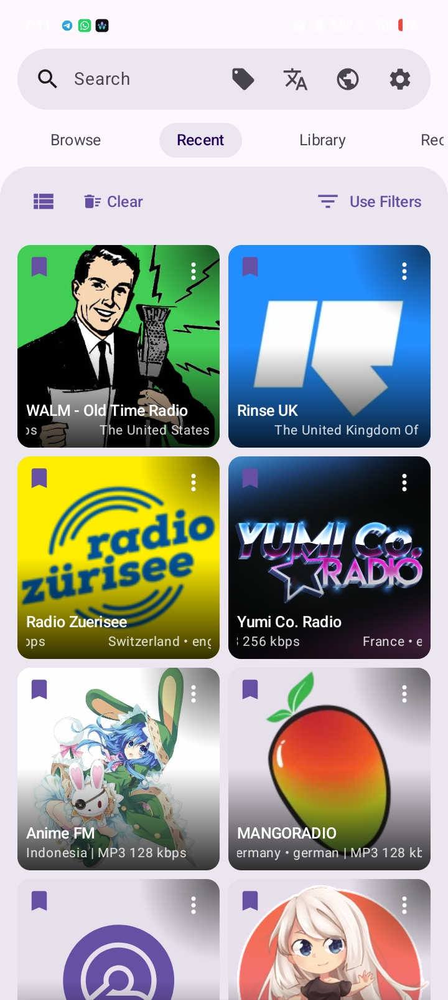
  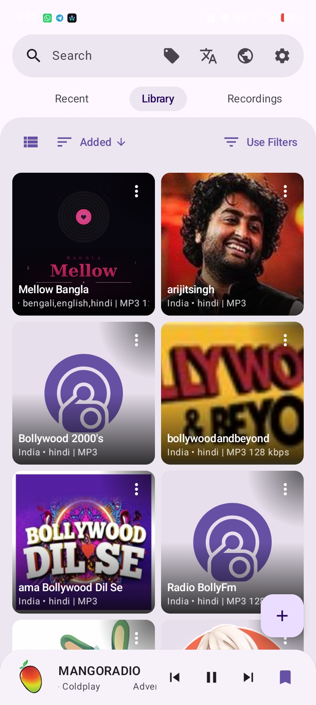
  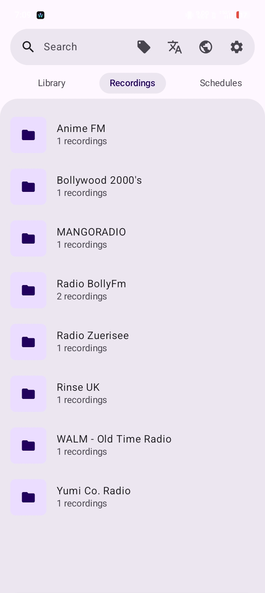
  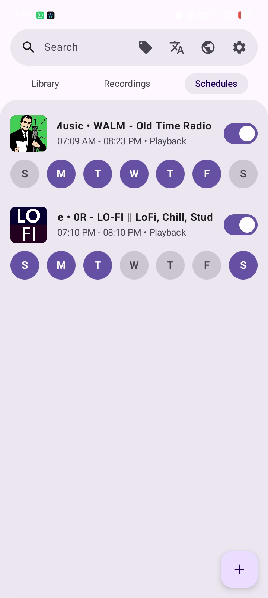
  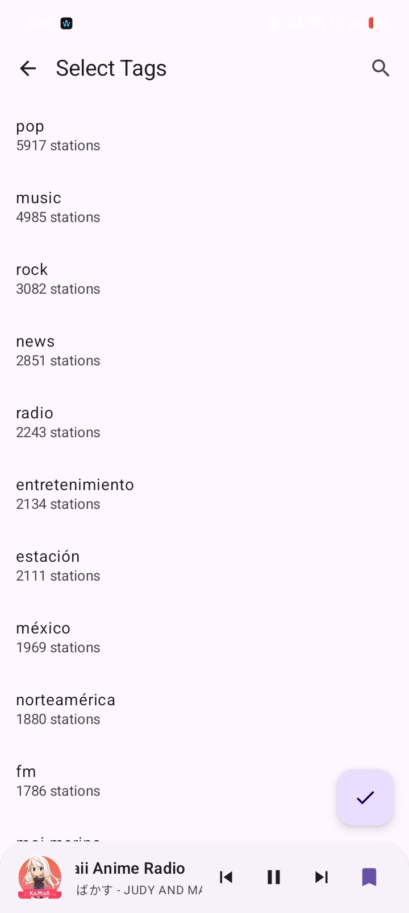
  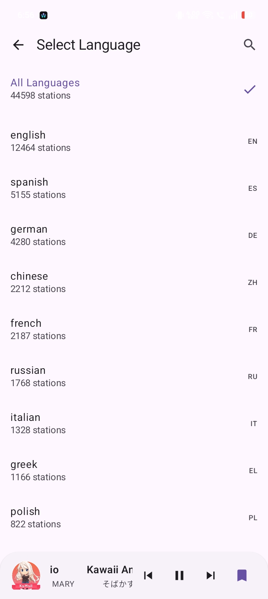
  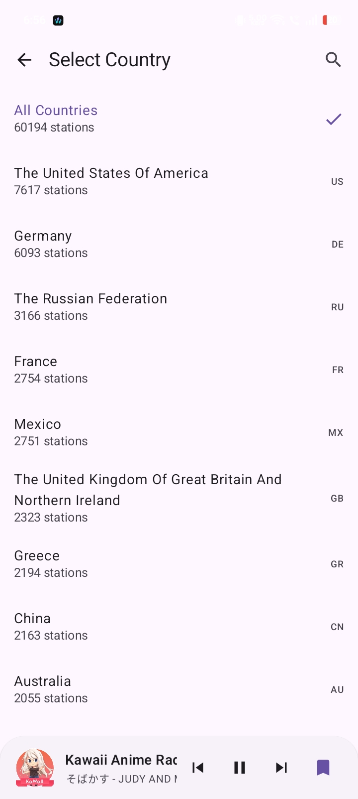
  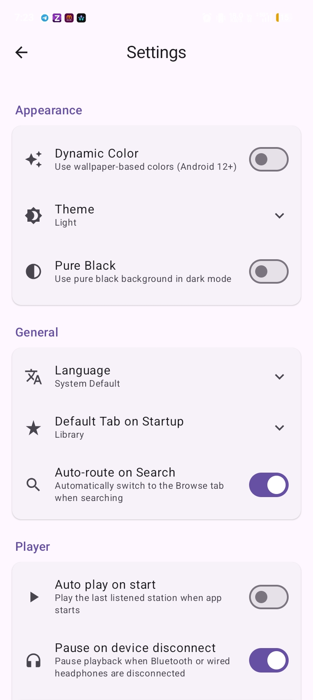
</div>

### Android TV

<div align="center">
  
  
  
  
</div>

## Tech Stack

- **Language**: [Kotlin](https://kotlinlang.org/)
- **UI Framework**: [Jetpack Compose](https://developer.android.com/jetpack/compose)
- **Database**: [Room](https://developer.android.com/training/data-storage/room)
- **Dependency Injection**: [Hilt](https://developer.android.com/training/dependency-injection/hilt-android)
- **APIs/Services**: [Radio Browser API](https://www.radio-browser.info/), [iTunes Search API](https://affiliate.itunes.apple.com/resources/documentation/itunes-store-web-service-search-api/), [LrcLib API](https://lrclib.net/), [FCast](https://fcast.org/)

## Building From Source

To build InternetRadio from source, ensure you have the latest version of Android Studio installed.

1. **Clone the repository**:
   ```bash
   git clone https://github.com/armanmaurya/internetradio.git
   ```
2. **Open the project** in Android Studio.
3. **Wait for Gradle sync** to complete.
4. **Run the app** on a physical device or emulator.

## Troubleshooting

If FCast is not discovering or connecting to your device on desktop Linux, your firewall may be blocking the required ports. This is a known issue with **UFW** and similar firewall tools. To allow FCast connections, run:

```bash
sudo ufw allow 46899/tcp
sudo ufw allow 46899/udp
```

---

## Contributing

Contributions are what make the open-source community such an amazing place to learn, inspire, and create. Any contributions you make are greatly appreciated.

Please see [CONTRIBUTING.md](CONTRIBUTING.md) for details on our code of conduct and the process for submitting pull requests.

## Contributors

<a href="https://github.com/armanmaurya/InternetRadio/graphs/contributors">
  
</a>

## Translation

Translations are managed on <a href="https://hosted.weblate.org/projects/internetradio/">Weblate</a> — no local setup needed, contribute directly from your browser.

<a href="https://hosted.weblate.org/engage/internetradio/"></a>

## Acknowledgments

- [Maintendo](https://github.com/Maintendo) - app logo.

## License

This project is licensed under the GNU GPL v3 License - see the [LICENSE](LICENSE) file for details.
